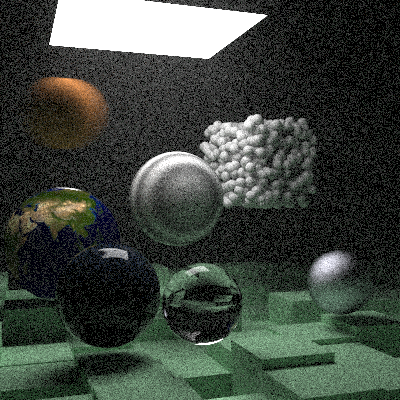
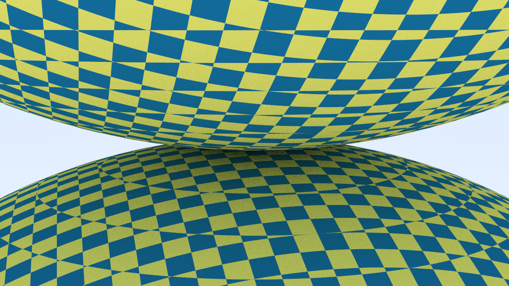
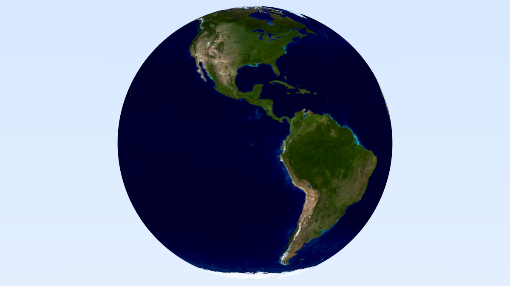
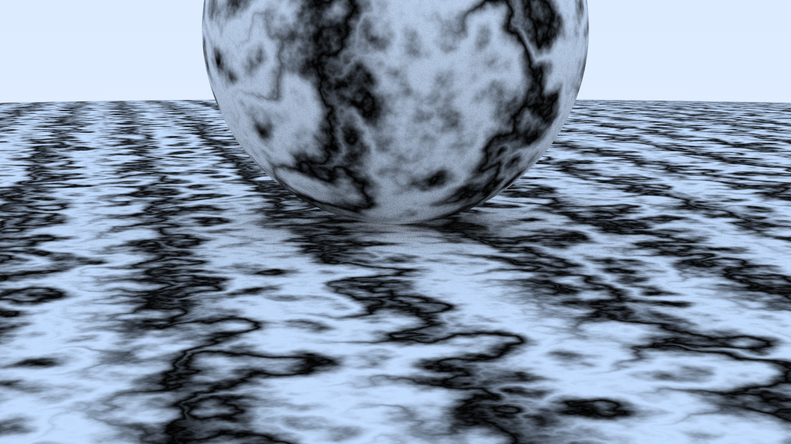
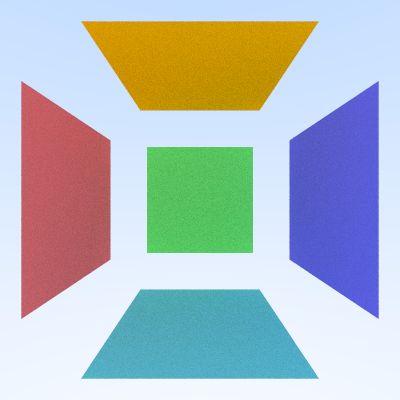
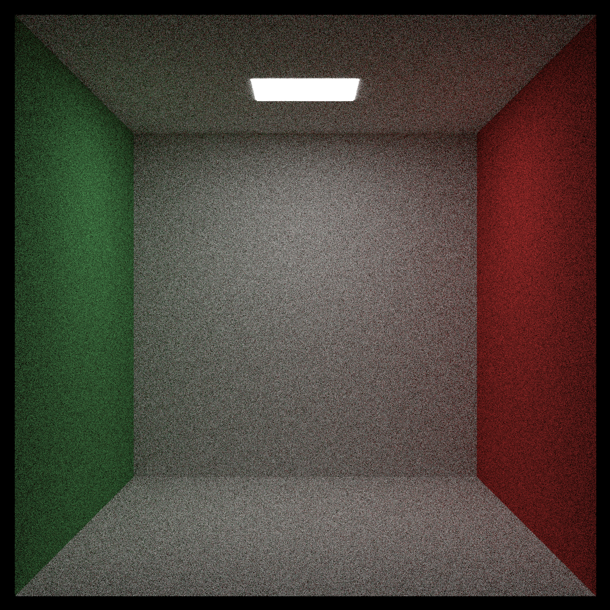
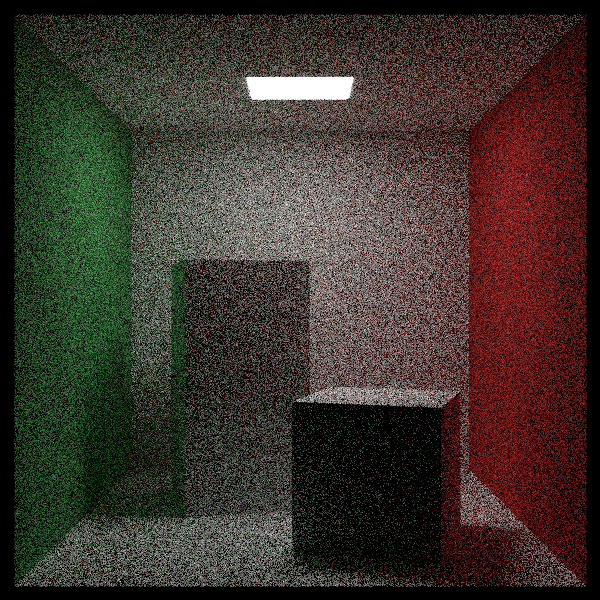
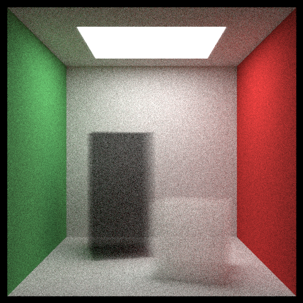
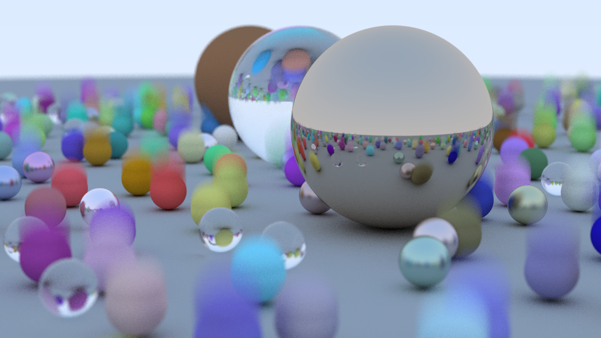

# Ray Tracing: The Next Week — in Python

A Python implementation of [_Ray Tracing: The Next Week_](https://raytracing.github.io/books/RayTracingTheNextWeek.html), the second book in Peter Shirley, Trevor David Black and Steve Hollasch's ray tracing series. Book 1 lives in [tarhanefe/ray-tracer](https://github.com/tarhanefe/ray-tracer).

Everything is plain Python and NumPy — no rendering libraries.



_The final scene: motion blur, a bounding volume hierarchy, textures, lights, instances and volumes. 400×400, 250 samples per pixel._

## Features

| Chapter | What it adds |
|---|---|
| Motion blur | `MovingSphere` travels between two centers; each camera ray carries a random time |
| Bounding volume hierarchies | `AABB` slab test and `BVH_Node`, a binary tree of boxes built by splitting along the longest axis |
| Texture mapping | `SolidColor`, `CheckerTexture`, `ImageTexture` (loads a JPEG/PNG) |
| Perlin noise | `Perlin` with trilinear interpolation, Hermite smoothing and turbulence; `NoiseTexture` for a marble look |
| Quadrilaterals | `Quad` with a plane test plus interior test in plane coordinates; `Box` is six quads |
| Lights | `DiffuseLight` and a background color, so unlit scenes go black |
| Instances | `Translate` and `RotateY` wrap another object and transform rays into its local frame |
| Volumes | `ConstantMedium` scatters rays randomly inside a boundary shape, using `Isotropic` — smoke, fog and mist |

## Gallery

| | |
|---|---|
|  Checkered texture |  Image texture |
|  Perlin marble |  Quads |
|  Cornell box |  Instances |
|  Volumes |  Motion blur |

## Project structure

| File | Contents |
|---|---|
| `vec3.py` | `Vec3` vector class and random helpers |
| `ray.py` | `Ray` — origin, direction, time and `at(t)` |
| `hitable.py` | `HitRecord`, `Sphere`, `MovingSphere`, `Quad`, `Box`, `HittableList`, `Translate`, `RotateY`, `Interval`, `AABB` and `BVH_Node` |
| `material.py` | `Lambertian`, `Metal`, `Dielectric`, `DiffuseLight` and `Isotropic` |
| `texture.py` | `SolidColor`, `CheckerTexture`, `ImageTexture` and `NoiseTexture` |
| `perlin.py` | Perlin noise with turbulence |
| `constant_medium.py` | `ConstantMedium` — volumes |
| `camera.py` | Camera with field of view, defocus blur and random ray times |
| `rtw_image.py` | Image loading for `ImageTexture` |
| `render_out.py` | All scenes, the ray color function and the parallel renderer |
| `ppm_out.py` | Book 1's small three-sphere scene, kept as a standalone script |

## Requirements

Python 3.10 or newer (the code uses `match` and `X | None` type syntax), NumPy and Pillow.

```sh
pip install -r requirements.txt
```

## Usage

Pick a scene with the `match` statement at the bottom of `render_out.py`, then run it:

```sh
python render_out.py
```

| Case | Scene |
|---|---|
| 1 | Bouncing spheres (motion blur) |
| 2 | Checkered spheres |
| 3 | Earth (image texture) |
| 4 | Perlin spheres |
| 5 | Quads |
| 6 | Simple light |
| 7 | Cornell box |
| 8 | Cornell smoke |
| 9 | Final scene, at the book's settings (800×800, 10000 samples) |
| anything else | Final scene, quick preview (400×400, 250 samples) |

The render is written to `output.ppm`. Convert it to PNG with any image tool, for example on macOS:

```sh
sips -s format png output.ppm --out output.png
```

## Performance

Rows are rendered in parallel across CPU cores with `multiprocessing`, and each scene is wrapped in a `BVH_Node` so a ray only tests objects whose boxes it passes through.

Pure Python is slow for this, so the hot paths avoid allocating: `Sphere.hit` and `Quad.hit` work in plain floats and only build `Vec3`s once a hit is confirmed, and `Box.hit` tests its bounding box before its six quads. Together with the BVH, that makes the final scene about 1.75× faster than the straightforward version.

Even so, the book's settings for the final scene (case 9) take hours. Case `_` renders the same scene in a few minutes, which is the one to start with.

## Credits

The book series is by Peter Shirley, Trevor David Black and Steve Hollasch, and is free to read at [raytracing.github.io](https://raytracing.github.io/).
